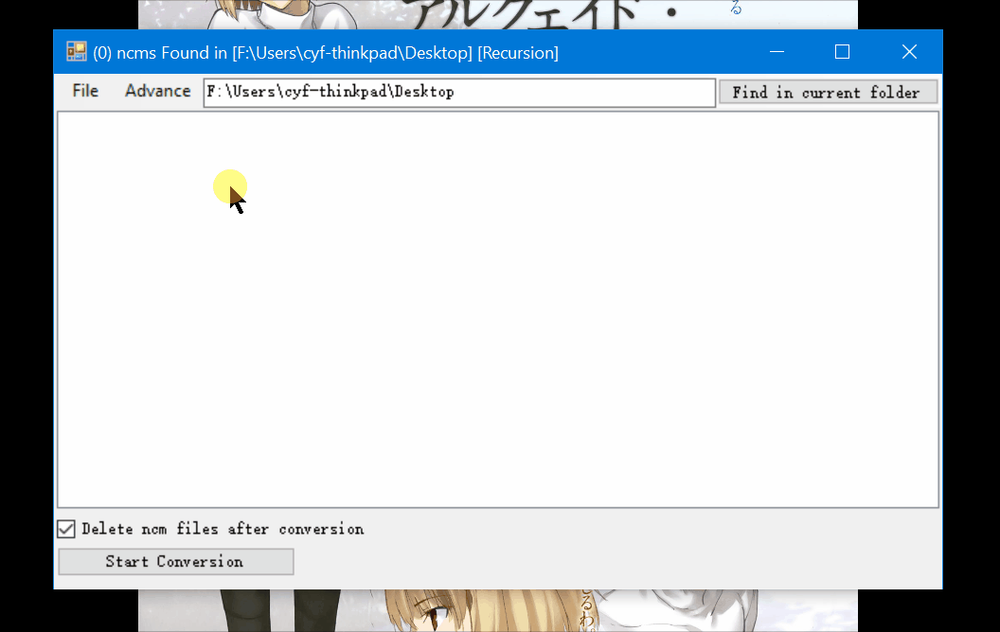
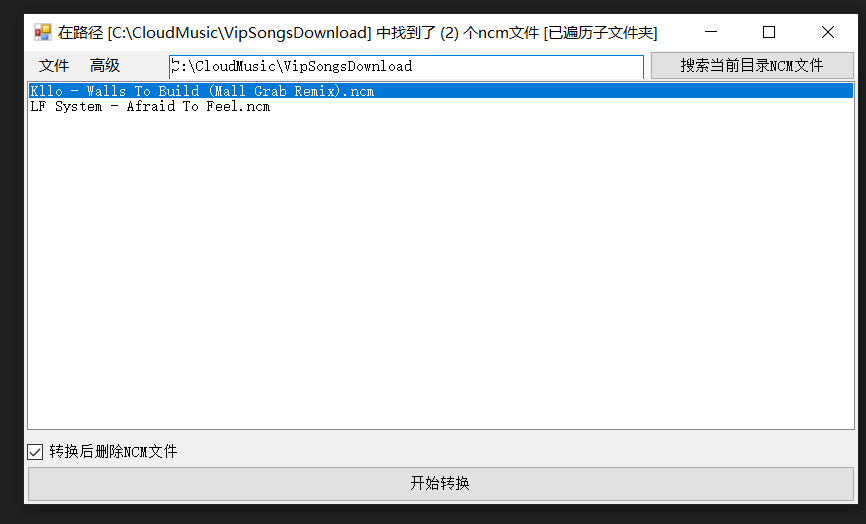

# ncmdumpHelper

下载 Release页面 

运行 ncmdump.App.exe

享受一键将ncm转化为MP3。

 

## 引用

[ncmdump](https://github.com/taurusxin/ncmdump)
main(ncmdump)版本 v1.5

## 事由

  日常随手将网易云上下载的歌曲丢进Walkman，但等到回头听的时候发现有好多歌都不见了😨，文件夹都是空的，这无非是歌曲格式读不出或者是歌曲没放进去。打开电脑一看，wdnmd原来是网易云自家的坑爹ncm格式，于是乎迅速百度一下寻找一下对策。每一次手动拖动又太复杂，于是乎工欲善其事必先利其器，随手写了个批量自动转化的工具。
  * 20250629
新买了台碟机，需要下载大量歌曲导入于是乎重新更新了下这个工具，enjoy。

